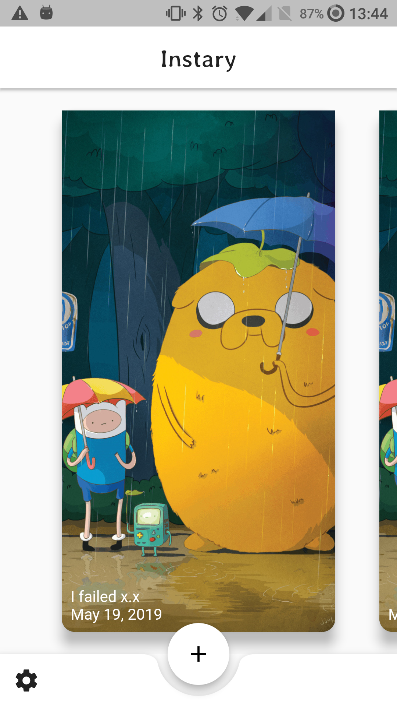
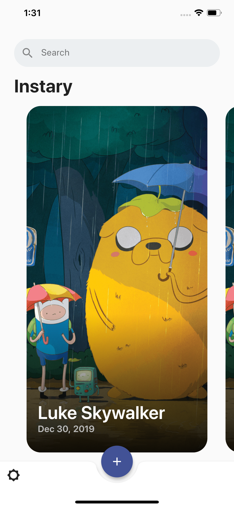
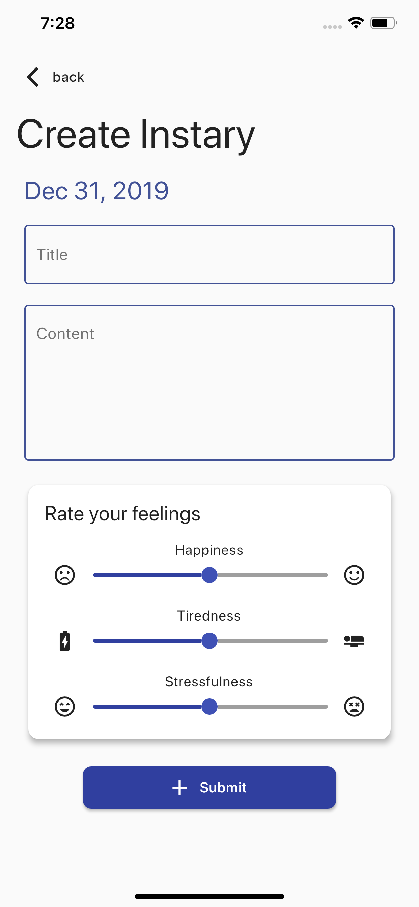
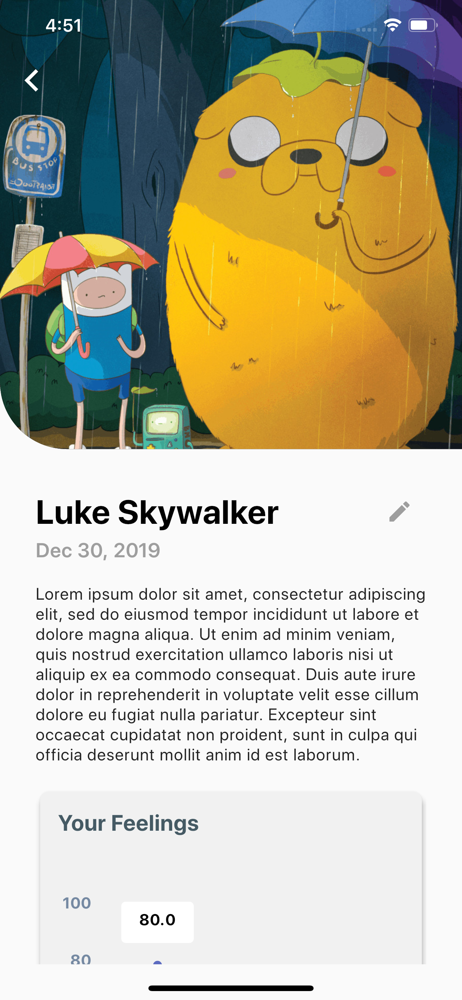
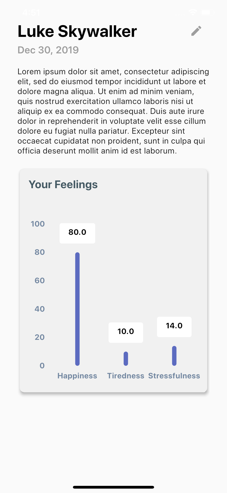

# Instary

An offline diary that keeps your thought, photos, mood and feelings all in one place.

## Installation

1. Click [here](https://drive.google.com/file/d/1pnfgE3v1rQKw8PjADrteneif2ihdbHCq/view) to download the apk file for Android
2. Transfer the apk file to your Android device
3. Tap the file from your Android device to install the application

p.s. Android version is in beta, iOS version is still in development

## Screenshot
|||
| :---: | :---: |
| Original Main Page Design | Current Main Page Design |

||||
| :---: | :---: | :---: |
| Create Page | View Page | View Page with details |

## Usage
**Instary** is an item that includes a picture, a description, and how you feel of the day.

### Create an Instary
Tap on the + button located at the bottom of the main page. Fill out the information on the create instary page and click submit. Your instary will save locally.

### Edit an Instary
Tap on the instary you want to edit, on the view page, click on the pen icon located next to the title. Then you will direct to the edit page. On this page, you can edit/ delete you instary. Click the save button at the bottom of the page to update your instary. As of now, you cannot recover an Instary if deleted.

## Run Instary in dev mode
1. Clone this repository
2. run `flutter run` in the project directory, you need to have flutter SDK installed in your machine

## Roadmap
### Instary 1.1

- [x] Add picture with camera option
- [x] Show your list is empty when there is no instary
- [ ] Sort by date
- [ ] Dark Mode
- [ ] Star to save special instary
- [ ] Save multiple pictures for a day

### Instary 1.2
- [ ] Search by date
- [ ] Import/ Export Instary
- [ ] Add chart to view progress
- [ ] Add video option
- [ ] Add security like password/ fingerprint lock the app
